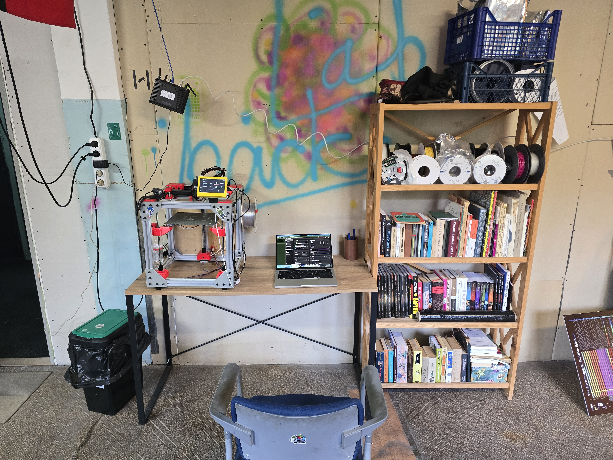

# Інформація про RatRig V-core 3 хакерспейсу NU31 у Києві



Адреса принтера: [ratos.local](http://ratos.local/)

# Потрібні файли для RatRig у NU31

- [NU31 RatRig 200.json](./NU31%20RatRig%20200.json) — файл налаштувань принтера для OrcaSlicer.
- [printer.cfg](./printer.cfg) — файл налаштувань самого RatRig (трішки відрізняється від того, що генерує RatOS wizard).

## Відмінності у файлі printer.cfg

Деякі зміни у файлі `printer.cfg` зроблені власноруч через те, що wizard не підтримує шпильки.

```cfg 
rotation_distance: 8      # 4 for TR8*4 lead screws
```

Виставлено 8, тому що у нас однозахідна різьба. Значення від wizard — 4, тому що за стандартом RatRig використовує двозахідну різьбу.
